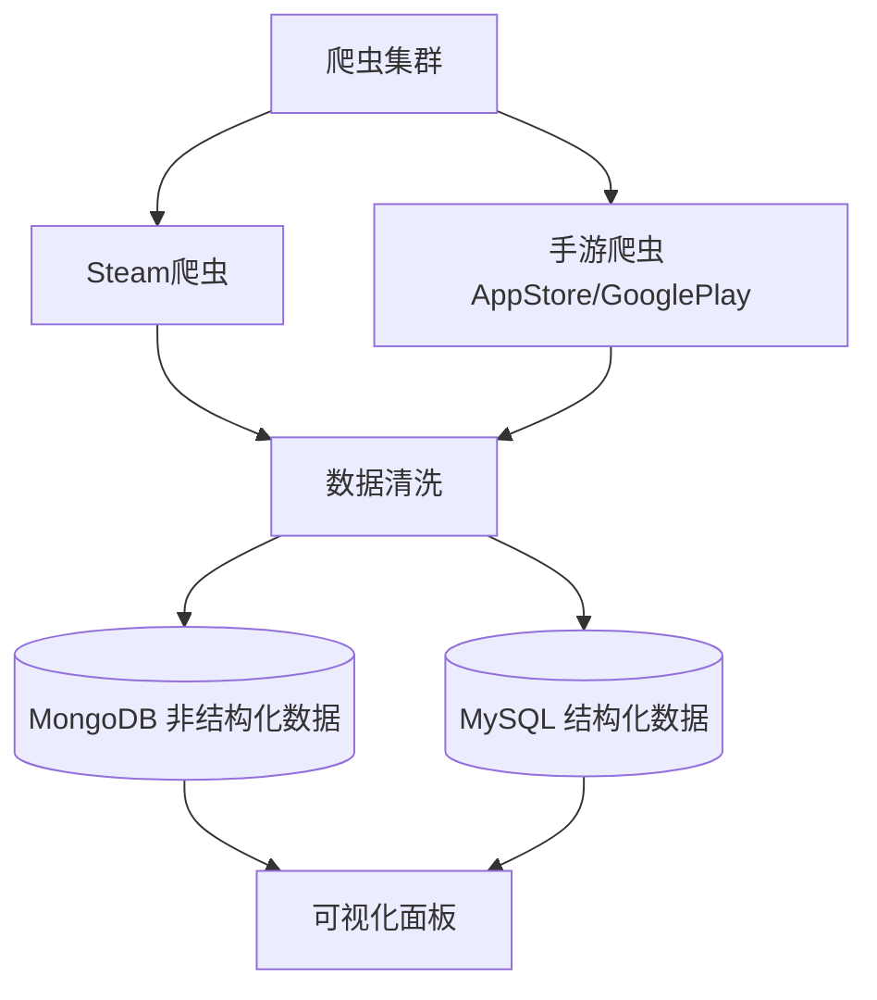

# 游戏行业数据爬虫项目

​**项目名称**​：`GameMarket-Crawler`  
​**功能概述**​：自动化爬取Steam平台及国内外手游市场数据（排行榜、评分、在线人数等），支持数据清洗、存储与可视化。  
​**技术栈**​：`Scrapy-Redis`（分布式爬虫） + `Playwright`（动态渲染） + `MongoDB/MySQL`（存储） + `Airflow`（调度）[6,7](https://tencent.yuanbao/@ref)

---

## 目录

1. [技术架构](https://tencent.yuanbao/chat?from=launch&conversation=686a4e44-f4a9-4f68-a311-5d1262bc1817&project_id=&project_name=&HY82=2&HY56=SlidePage#%E6%8A%80%E6%9C%AF%E6%9E%B6%E6%9E%84)
2. [安装指南](https://tencent.yuanbao/chat?from=launch&conversation=686a4e44-f4a9-4f68-a311-5d1262bc1817&project_id=&project_name=&HY82=2&HY56=SlidePage#%E5%AE%89%E8%A3%85%E6%8C%87%E5%8D%97)
3. [数据采集目标](https://tencent.yuanbao/chat?from=launch&conversation=686a4e44-f4a9-4f68-a311-5d1262bc1817&project_id=&project_name=&HY82=2&HY56=SlidePage#%E6%95%B0%E6%8D%AE%E9%87%87%E9%9B%86%E7%9B%AE%E6%A0%87)
4. [爬虫代码结构](https://tencent.yuanbao/chat?from=launch&conversation=686a4e44-f4a9-4f68-a311-5d1262bc1817&project_id=&project_name=&HY82=2&HY56=SlidePage#%E7%88%AC%E8%99%AB%E4%BB%A3%E7%A0%81%E7%BB%93%E6%9E%84)
5. [配置说明](https://tencent.yuanbao/chat?from=launch&conversation=686a4e44-f4a9-4f68-a311-5d1262bc1817&project_id=&project_name=&HY82=2&HY56=SlidePage#%E9%85%8D%E7%BD%AE%E8%AF%B4%E6%98%8E)
6. [数据存储](https://tencent.yuanbao/chat?from=launch&conversation=686a4e44-f4a9-4f68-a311-5d1262bc1817&project_id=&project_name=&HY82=2&HY56=SlidePage#%E6%95%B0%E6%8D%AE%E5%AD%98%E5%82%A8)
7. [法律合规](https://tencent.yuanbao/chat?from=launch&conversation=686a4e44-f4a9-4f68-a311-5d1262bc1817&project_id=&project_name=&HY82=2&HY56=SlidePage#%E6%B3%95%E5%BE%8B%E5%90%88%E8%A7%84)
8. [贡献指南](https://tencent.yuanbao/chat?from=launch&conversation=686a4e44-f4a9-4f68-a311-5d1262bc1817&project_id=&project_name=&HY82=2&HY56=SlidePage#%E8%B4%A1%E7%8C%AE%E6%8C%87%E5%8D%97)
9. [许可证](https://tencent.yuanbao/chat?from=launch&conversation=686a4e44-f4a9-4f68-a311-5d1262bc1817&project_id=&project_name=&HY82=2&HY56=SlidePage#%E8%AE%B8%E5%8F%AF%E8%AF%81)

---

### 一、技术架构 {#技术架构}



- ​**核心组件**​：
    - ​**采集层**​：Scrapy-Redis调度 + Playwright渲染动态页面
    - ​**反爬策略**​：住宅IP代理池 + Chrome指纹模拟 + 随机延迟(1-3秒)
    - ​**数据处理**​：Pandas清洗 + PySpark分析用户评论情感
    - ​**部署**​：Airflow每日自动调度[6,7](https://tencent.yuanbao/@ref)

---

### 二、安装指南 {#安装指南}

#### 环境要求

- Python 3.8+
- Redis 5.0+（分布式任务队列）
- MongoDB 4.4+ / MySQL 8.0+

#### 环境设置

**方法1：使用conda环境（推荐）**

```shell
# 克隆项目
git clone https://github.com/cmseric/gamemarket_crawler.git
cd gamemarket_crawler

# 创建并激活conda环境
conda create -n gamemarket_crawler python=3.11 -y
conda activate gamemarket_crawler

# 安装依赖
pip install -r requirements.txt

# 初始化Playwright浏览器
playwright install chromium

# 启动Redis（Docker方式）
docker run -d --name redis-crawler -p 6379:6379 redis:latest
```

**方法2：使用项目提供的环境配置文件**

```shell
# 使用environment.yml创建环境
conda env create -f environment.yml

# 激活环境
conda activate gamemarket_crawler

# 运行环境检查脚本
python run_project.py
```

**方法3：快速激活脚本**

```shell
# 使用项目提供的激活脚本
source activate_env.sh

# 或者直接运行项目启动脚本
python run_project.py
```

**VS Code用户设置**

项目已包含`.vscode/settings.json`配置，VS Code会自动使用正确的Python解释器。

---

### 三、数据采集目标 {#数据采集目标}

|​**数据来源**​|​**字段示例**​|
|---|---|
|​**Steam平台**​|游戏名称、当前价格、峰值在线人数、近期好评率、DLC更新日期|
|​**手游商店**​|下载量、内购平均收入(IAP)、评分、开发商、发行日期（iOS/Android/TapTap）|
|​**用户生成内容**​|评论情感倾向、热门标签、关键词频率|

> ​**注**​：禁止爬取用户ID、交易记录等隐私数据[1,6](https://tencent.yuanbao/@ref)

---

### 四、爬虫代码结构 {#爬虫代码结构}

```
game-crawler/
├── scraper/                  # 爬虫核心模块
│   ├── spiders/
│   │   ├── steam_spider.py   # Steam爬虫（示例见下方代码）
│   │   └── mobile_spider.py  # 手游爬虫
│   ├── middlewares/          # 反爬中间件（代理/IP轮换）
│   ├── pipelines/            # 数据存储管道
│   ├── settings.py           # 爬虫配置（请求头、延迟等）
│   └── utils.py               # 工具函数（数据清洗、加密）
├── config/                   # 配置文件
│   ├── proxies.txt           # 代理IP列表
│   └── user_agents.txt       # User-Agent池
├── airflow_dags/             # 调度任务（每日自动运行）
└── README.md                 # 项目文档[7](@ref)
```

#### 示例爬虫代码（`steam_spider.py`）

```py
import scrapy
from scraper.items import SteamGameItem

class SteamTopSellersSpider(scrapy.Spider):
    name = "steam_top100"
    start_urls = ["https://store.steampowered.com/search/?filter=topsellers"]
    custom_settings = {
        "DOWNLOAD_DELAY": 2,  # 合规延迟
        "PLAYWRIGHT_ENABLED": True  # 启用动态渲染
    }

    def parse(self, response):
        games = response.css('div#search_resultsRows a')
        for game in games:
            item = SteamGameItem()
            item['name'] = game.css('span.title::text').get()
            item['price'] = game.css('div.discount_final_price::text').get()
            # 进入详情页抓取实时数据
            detail_url = game.attrib['href']
            yield response.follow(detail_url, self.parse_detail, meta={'item': item})
    
    def parse_detail(self, response):
        item = response.meta['item']
        item['peak_players'] = response.xpath('//div[@class="peak_players"]/text()').get()
        yield item
```

---

### 五、配置说明 {#配置说明}

修改 `scraper/settings.py` 关键配置：

```py
# 启用Playwright渲染
DOWNLOAD_HANDLERS = {
    "http": "scrapy_playwright.handler.ScrapyPlaywrightDownloadHandler",
    "https": "scrapy_playwright.handler.ScrapyPlaywrightDownloadHandler"
}

# 代理设置（从文件轮换读取）
PROXY_LIST = 'config/proxies.txt'
PROXY_MODE = 0  # 0=随机, 1=轮询

# 遵守Robots协议
ROBOTSTXT_OBEY = True
```

---

### 六、数据存储 {#数据存储}

#### MySQL表结构示例

```sql
CREATE TABLE steam_games (
    id INT AUTO_INCREMENT PRIMARY KEY,
    name VARCHAR(255) NOT NULL,
    price DECIMAL(10,2),
    peak_players INT,
    positive_rate FLOAT,
    crawl_date DATE
);
```

- ​**MongoDB存储**​：用户评论原文及情感分析结果（BERT模型生成）

---

### 七、法律合规 {#法律合规}

✅ ​**允许行为**​：

- 爬取公开排行榜、游戏描述、评分（非个人信息）
- 遵守`robots.txt`，请求频率≤10次/秒
- 数据脱敏处理（如设备ID哈希加密）

❌ ​**禁止行为**​：

- 抓取用户隐私（ID、聊天记录）
- 绕过付费内容防护
- 导致目标服务器过载

> ​**参考案例**​：腾讯诉DD373案（赔偿3000万）[1,6](https://tencent.yuanbao/@ref)

---

### 八、贡献指南 {#贡献指南}

1. ​**问题报告**​：在GitHub提交Issue
2. ​**代码提交**​：
    - Fork仓库 → 创建特性分支 → 提交PR
    - 遵循PEP8代码规范，添加单元测试
3. ​**文档更新**​：修改`README.md`或Wiki

---

### 九、许可证 {#许可证}

本项目采用 ​**MIT 许可证**​ - 详情见 [LICENSE](https://opensource.org/licenses/MIT)

> 允许商用修改，但需保留原作者署名[3](https://tencent.yuanbao/@ref)

---

​**下一步建议**​：

1. 在Cursor中粘贴此README，输入`/`生成项目骨架代码
2. 修改 `config/proxies.txt` 补充代理IP
3. 调整 `scraper/settings.py` 中的爬虫参数

> ​**完整代码参考**​：[Steam爬虫示例](https://gitee.com/stonedtx/open-spider) | [手游数据解析工具](https://gitee.com/stonedtx/free-nlp-api)